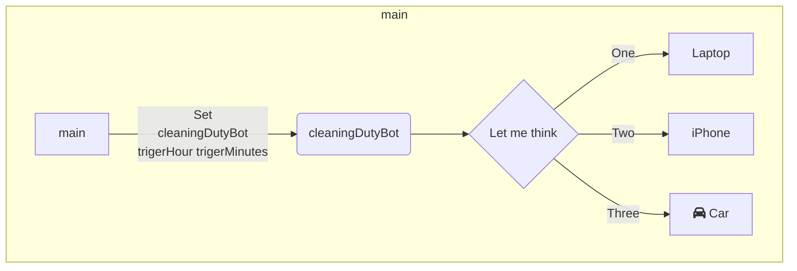

## main()
1. スクリプトプロパティにセットした、トリガー実行時間を取得
   1. 変数trigerHourとtrigerMuniteに代入
2. setTrigerに引数：cleaningDutyBot,trigerHour,trigerMuniteを渡し、指定した時間にcleaningDutyBotが実行されるようにする

## 毎週金曜日の予定から休暇、休みがタイトルに入っているものを抽出する